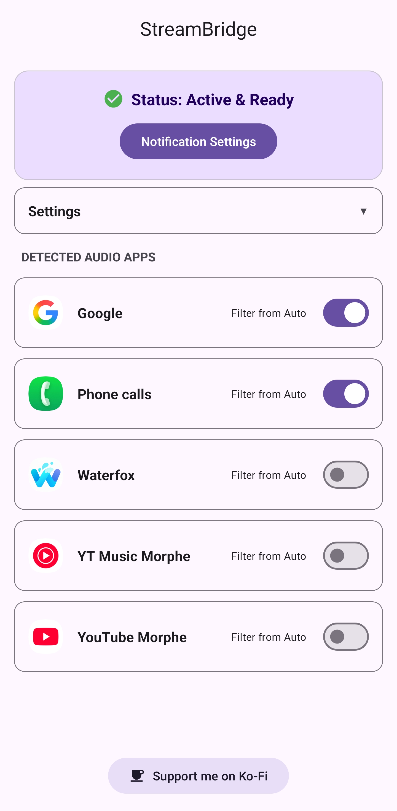

# StreamBridge

> **The missing link for Android Auto audio.** > A modern successor to AnyAutoAudio with working timeline scrubbing, seek buttons, and app blacklisting.

[Latest Release](https://img.shields.io/github/v/release/jacobpina1/StreamBridge)

**StreamBridge** is a utility that acts as a bridge between non-standard audio apps and Android Auto. If you listen to audio from sources that don't natively support Android Auto (like web browsers, YouTube, or niche media players), StreamBridge intercepts their notifications and forwards them to your car's head unit as a fully functional media session.

## Key Features

* Universal Bridging: Forwards audio controls from *any* app with a notification to Android Auto.
* Working Scrubbing: Allows timeline scrubbing on your car's display.
* Custom Seek Buttons: Customizable seek time (defaults to **-10s** and **+30s**).
* App Blacklist: Prevent any app you choose from accidentally taking over the music session.
* Auto-Resume: Configurable option to automatically resume playback when Bluetooth connects to your vehicle/Android Auto.
* Root Not Required: Works on all devices running Android 8.0+.

## Screenshots
 

## Installation

1.  Download the latest APK from the [Releases Page](../../releases).
2.  Install the APK on your device.
3.  Open StreamBridge and grant **Notification Access** when prompted.
4.  Enable Unknown Sources in Android Auto developer settings.
5.  In Android Auto, select "StreamBridge" from the app list.
